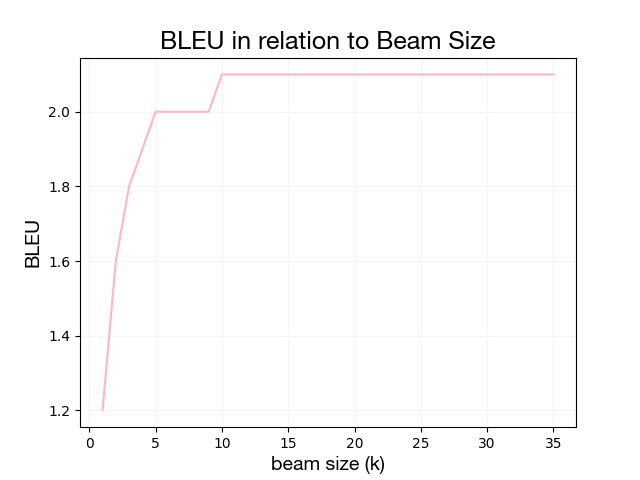

# MT Exercise 5: Byte Pair Encoding, Beam Search

# Requirements

None other than the ones in the [original repo](https://github.com/emmavdbold/mt-exercise-5). 

# Infos on Scripts / Steps

I used the provided dataset with the languages English and Italian, going from en to it.    
First, the data can be preprocessed slightly (i.e., tokenized), usind the `preprocess.sh` script.    
To train and apply the BPE model, the script `bpe_pre.sh` can be used.     
To train the models, there's the `train.sh` and `train_bpe.sh` respectively.     
After training, of course the `evaluate.sh` can be used to see how the models do, there's also a version that facilitates the comparisons of the different beam sizes (`evaluate_beam.sh`).      
Finally, to visualize the relationship the beam size and BLEU score have, the pyhton script `beam.py` can be run, after plugging in the values obtained for the different sizes. 

# Findings

All using k = 5 for beam search.

| Use BPE | Vocabulary Size | BLEU |
| :---         |     :---:      |          ---: |
| no   | 5000     | 12.98    |
| yes     | 5000       | 19.49      |
| yes     | 1500       | 2.50      |

# Commentary

First of all, I'd like to thank you again for the leniency regarding the deadline. 
Unfortunately, however, I still cannot submit answers that are actually to my liking, due to a very stupid mishap on my part (exam period really got my brain working on subpar standards). I forgot to adjust the `mkdir` variable in the configuration script for the respective models – so the data of the most recent model simply overwrote the previous ones. This, of course, means that I was not able to perform the beam search experiment for the best model, but had to use the most recent one (the worst one, actually) – and also that I was not able to manually investigate and compare all of the models. I can only look at the translations done by the 1.5k vocab BPE model, which are not very good.    
At least I still do know the BLEU scores of the other models, seeing as the log files were preserved. Unsurprisingly, the ones with the larger vocabularies (5k, in fact) are much better than the one with a size of only 1.5k words. 

Below can be seen how BLEU progresses as the beam size increases. It stagnates after k = 9, but I do not know whether that is simply due to the low performance of the model over all (i.e., because of the small vocabulary size). 

